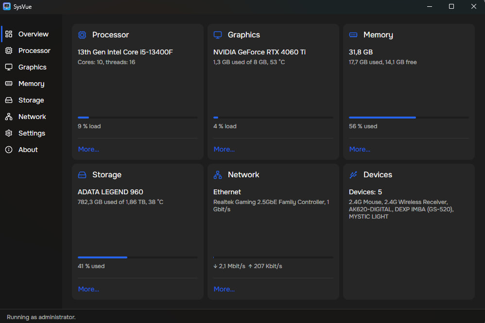
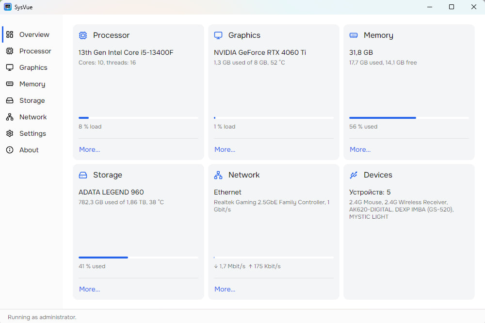
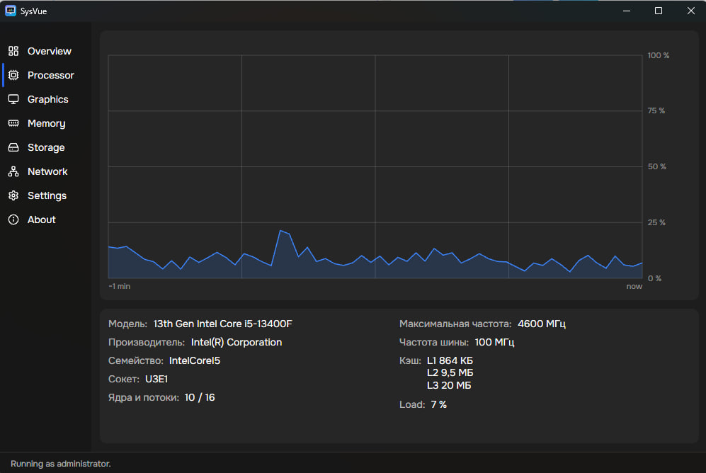
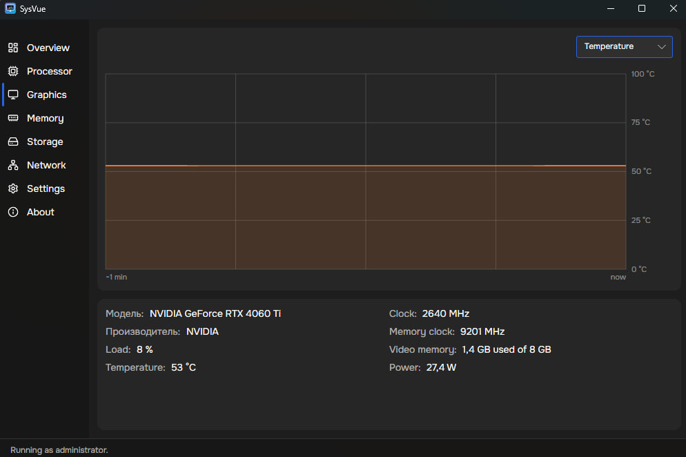
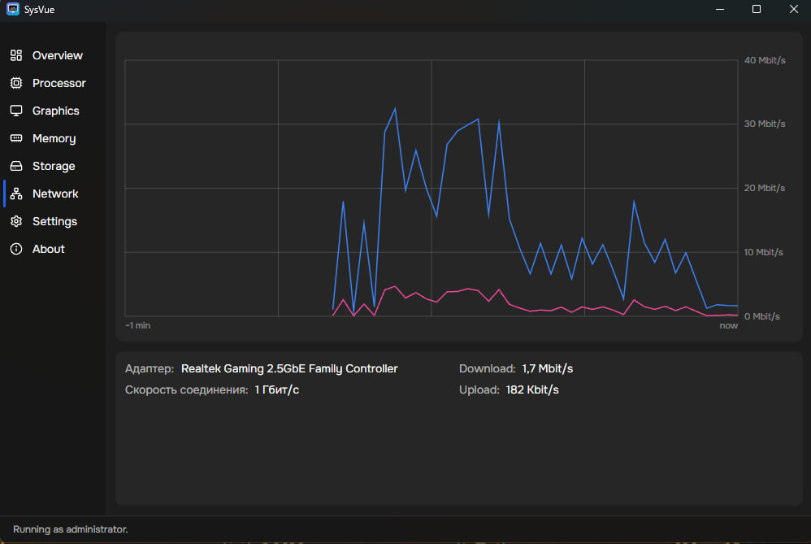

<div align="center">


# SysVue ⚡

### 🖥️ Your PC's vitals, live — in one small window.

CPU, GPU, memory, storage and network readings, updated every second.<br/>
No installer, no service, no telemetry. Just one `.exe`. 🪶

[](../../releases)
[](../../releases)
[](../../actions/workflows/ci.yml)
[](LICENSE)


<br/>



</div>

---

## ✨ Why SysVue

| | |
|---|---|
| ⚡ **Live, every second** | Sensors are polled once a second; every chart keeps the last 60 seconds of history. |
| 🎯 **One glance, one screen** | The overview puts every component on its own card — the key number plus one short detail line. |
| 📈 **Charts that mean something** | Load and temperature over time, no decoration, no fake gauges. |
| 🪶 **Featherweight** | A single `SysVue.exe`. Nothing to install, nothing left in the registry, no background service. |
| 🔓 **Works without admin** | Runs fine as a normal user; elevating only adds storage temperature and disk models. |
| 🎨 **Light & dark, EN & RU** | Follows the system theme or your pick, in English or Russian. |
| 🔒 **Offline by design** | No accounts, no updates phoning home, no analytics. |

---

## 📸 Screenshots

<table>
  <tr>
    <td width="50%" valign="top"><br/><b>🏠 Overview — light theme</b><br/>The same six cards, on white.</td>
    <td width="50%" valign="top"><br/><b>🧠 Processor</b><br/>Load over the last minute, plus model, socket, cache and clocks.</td>
  </tr>
  <tr>
    <td width="50%" valign="top"><br/><b>🎮 Graphics</b><br/>Switch the chart between load and temperature; clocks, video memory and power below.</td>
    <td width="50%" valign="top"><br/><b>🌐 Network</b><br/>Download and upload on one chart, two colors, no fill.</td>
  </tr>
</table>

---

## 🚀 Get it

1. 📥 Download `SysVue.exe` from the [**Releases**](../../releases) page.
2. ▶️ Run it. That's the whole installation.
3. ⚙️ Optional: tick **Start with administrator rights** in Settings to unlock storage sensors.

> 💡 Windows SmartScreen may warn about an unsigned app — *More info → Run anyway*.

---

## 🧭 What's inside

| Section | What you get |
|---|---|
| 🏠 **Overview** | A card per component: processor, graphics, memory, storage, network, devices. Each card links to its section. |
| 🧠 **Processor** | Model, cores and threads, socket, clock, cache, features, power draw, load and temperature charts. |
| 🎮 **Graphics** | Adapter, video memory, core and memory clocks, load, temperature, power. |
| 🧮 **Memory** | Total, used and free, module list, load chart. |
| 💾 **Storage** | Per-drive model, file system, used and free space, temperature *(admin only)*. |
| 🌐 **Network** | Adapter, link speed, download and upload speed on a single two-color chart. |
| ⚙️ **Settings** | Theme (system / light / dark), language (English / Russian), elevated start. |
| ℹ️ **About** | Version and the full third-party license texts. |

---

## 🛠️ Build from source

Requires the [.NET 10 SDK](https://dotnet.microsoft.com/download).

```bash
git clone https://github.com/d1zainer/SysteminfoProgramm.git
cd SysteminfoProgramm
dotnet run
```

Self-contained single-file build:

```bash
dotnet publish -p:PublishProfile=win-x64
```

---

## 🧩 Built with

[**Avalonia**](https://avaloniaui.net/) · [**LibreHardwareMonitorLib**](https://github.com/LibreHardwareMonitor/LibreHardwareMonitor) · [**CommunityToolkit.Mvvm**](https://github.com/CommunityToolkit/dotnet) · [**HidSharp**](https://www.nuget.org/packages/HidSharp) · [**Lucide**](https://lucide.dev/) icons · [**Onest**](https://fonts.google.com/specimen/Onest) font

---

## 📄 License

SysVue's own code is under the [**MIT License**](LICENSE).

The app bundles the **Onest** font (SIL Open Font License 1.1), **Lucide** icons (ISC / MIT) and **LibreHardwareMonitorLib** (Mozilla Public License 2.0). Full license texts and copyright notices are shown in the app's About screen.

<div align="center">

⭐ **Like it? Star the repo — it helps.** ⭐

</div>